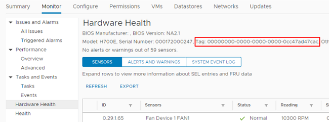
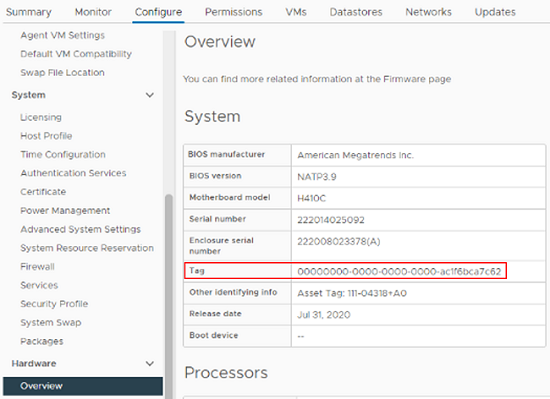

= コンピューティングノードのハードウェアタグを確認する方法
:allow-uri-read: 

[role="lead"]
REST API UI を使用してコンピューティングノードアセットを管理ノードの構成に追加するには、ハードウェアタグが必要です。

このセクションでは、コンピューティングノードのハードウェアタグを確認する方法について説明します。

.手順
. vSphere Web Client ナビゲータでホストを選択します。
. [*Monitor*] タブを選択し、 [*Hardware Health*] を選択します。
. 実行している vSphere のバージョンに応じて、ハードウェアタグは * Hardware Health * 画面の次のいずれかの場所にあります。
+
** タグが BIOS の製造元とモデル番号で表示されているかどうかを確認します。
+

** [ * 構成 * （ Configure * ） ] タブを選択します。サイドバーから、「 * Hardware * 」および「 * Overview * 」を選択します。ハードウェアタグが「システム」テーブルに表示されているかどうかを確認します。
+

. 「タグ」の値をコピーして保存します。
. コンピューティングノードアセットを管理ノードに追加するには、に進みます xref:task_mnode_add_assets.adoc[管理ノードにコンピューティングアセットとコントローラアセットを追加します]。

