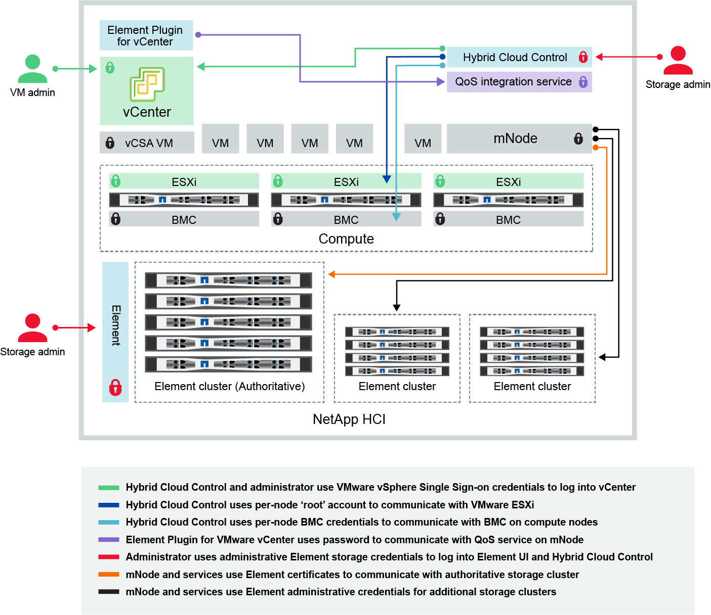

= NetApp HCI と NetApp SolidFire でクレデンシャルを変更
:allow-uri-read: 
:icons: font
:imagesdir: ../media/

[role="lead"]
NetApp HCI または NetApp SolidFire を導入している組織内のセキュリティポリシーに応じて、クレデンシャルやパスワードの変更はセキュリティの手法の一部として一般的に行われます。パスワードを変更する前に、導入環境内の他のソフトウェアコンポーネントへの影響を確認しておく必要があります。

NetApp HCI 環境または NetApp SolidFire 環境のいずれかのコンポーネントのクレデンシャルを変更する場合、次の表に示すガイダンスに従って他のコンポーネントに影響を与えます。

NetApp HCI コンポーネントの相互作用：

[cols="10a,60a,30a"]
|===
| 資格情報の種類とアイコン | 管理者による使用状況 | これらの手順を参照してください 

 a| 
Element クレデンシャル

 a| 
* 環境 * ： NetApp HCI および SolidFire

管理者は、次の資格情報を使用してログインします。

* Element ストレージクラスタの Element ユーザインターフェイス
* 管理ノードでの Hybrid Cloud Control （ mNode ）

Hybrid Cloud Control で複数のストレージクラスタを管理している場合は、ストレージクラスタの管理クレデンシャルのみを受け入れます。このクレデンシャルは、「 _authoritative cluster_that the mnode was initially set for 」と呼ばれます。ストレージクラスタがあとで Hybrid Cloud Control に追加された場合、 mnode は管理者クレデンシャルを安全に保存します。以降に追加したストレージクラスタのクレデンシャルが変更された場合は、 mnode API を使用して mNode でクレデンシャルを更新する必要があります。
 a| 
* https://docs.netapp.com/us-en/element-software/storage/concept_system_manage_manage_cluster_administrator_users.html["ストレージクラスタの管理者パスワードを更新する"^]。
* を使用して、 mNode のストレージクラスタ管理者のクレデンシャルを更新します 。 https://docs.netapp.com/us-en/element-software/api/reference_element_api_modifyclusteradmin.html["modifyclusteradmin API"^]。

 a| 
vSphere Single Sign-On のクレデンシャル

image::../media/icon_lock_green_light.png[緑色のライトロックアイコン]
 a| 
* 環境 * ： NetApp HCI のみ

管理者は、このクレデンシャルを使用して VMware vSphere Client にログインします。vCenter が NetApp HCI のインストールに含まれている場合、 NetApp Deployment Engine でクレデンシャルが次のように設定されます。

* 指定したパスワード、およびを使用する username@vsphere.loca
* 指定したパスワードを持つ administrator@vsphere.loca既存の vCenter を使用して NetApp HCI を導入する場合、 vSphere のシングルサインオンクレデンシャルは IT VMware 管理者が管理します。

 a| 
https://docs.netapp.com/us-en/hci/docs/task_hci_credentials_vcenter_esxi.html#%20update-the-esxi-password-by-using-the-management-node-rest-api["vCenter および ESXi のクレデンシャルを更新します"]。 

 a| 
ベースボード管理コントローラ（ BMC ）のクレデンシャル

 a| 
* 環境 * ： NetApp HCI のみ

管理者は、このクレデンシャルを使用して、 NetApp HCI 環境のネットアップコンピューティングノードの BMC にログインします。BMC は、基本的なハードウェア監視機能と仮想コンソール機能を備えています。

各ネットアップコンピューティングノードの BMC （ _ipmi_ とも呼ばれる）クレデンシャルは、 NetApp HCI 環境の mNode に安全に保管されます。NetApp Hybrid Cloud Control は、サービスアカウント容量の BMC クレデンシャルを使用して、コンピューティングノードのファームウェアアップグレード中にコンピューティングノード内の BMC と通信します。

BMC のクレデンシャルが変更された場合、 mNode のすべての Hybrid Cloud Control 機能を維持するには、各コンピューティングノードのクレデンシャルも更新する必要があります。
 a| 
* link:https://docs.netapp.com/us-en/hci/docs/hci_prereqs_final_prep.html["NetApp HCI の各ノードに IPMI を設定します"]。
* H410C 、 H610C 、および H615C ノードの場合、 link:https://docs.netapp.com/us-en/hci/docs/hci_prereqs_final_prep.html["デフォルトの IPMI パスワードを変更します"]。
* H410S および H610S ノードの場合、 https://docs.netapp.com/us-en/element-software/storage/task_post_deploy_credential_change_ipmi_password.html["デフォルトの IPM パスワードを変更します"^]。
* link:https://docs.netapp.com/us-en/hci/docs/task_hcc_edit_bmc_info.html["管理ノードで BMC クレデンシャルを変更します"^]。

 a| 
ESXi クレデンシャル

image::../media/icon_lock_green_dark.png[濃い緑のロックアイコン]
 a| 
* 環境 * ： NetApp HCI のみ

管理者は、 SSH またはローカル DCUI を使用して、ローカルの root アカウントで ESXi ホストにログインできます。NetApp HCI 環境では、ユーザ名は「 root 」で、パスワードは NetApp Deployment Engine でのコンピューティングノードの初回インストール時に指定されています。

ネットアップの各コンピューティングノードの ESXi ルートクレデンシャルが、 NetApp HCI 環境に mNode に安全に保存されている。NetApp Hybrid Cloud Control は、サービスアカウント容量のクレデンシャルを使用して、コンピューティングノードのファームウェアアップグレードや健全性チェックで ESXi ホストと直接通信します。

VMware 管理者が ESXi のルートクレデンシャルを変更した場合、各コンピューティングノードのクレデンシャルを mNode で更新し、ハイブリッドクラウド制御機能を維持する必要があります。
 a| 
link:https://docs.netapp.com/us-en/hci/docs/task_hci_credentials_vcenter_esxi.html["vCenter および ESXi ホストのクレデンシャルを更新します"^]。

 a| 
QoS 統合パスワード

image::../media/icon_lock_purple.png[紫色のロックアイコン]
 a| 
* 環境 * ： NetApp HCI および SolidFire ではオプション

管理者による対話型ログインには使用されません。

VMware vSphere と Element ソフトウェアの QoS 統合は、次の機能を通じて実現します。

* vCenter Server 向け Element プラグイン、および
* mNode の QoS サービス。

認証の場合、 QoS サービスは、このコンテキストでのみ使用されるパスワードを使用します。QoS のパスワードは、 Element Plug-in for vCenter Server の初回インストール時に指定するか、 NetApp HCI の導入時に自動生成されます。

他のコンポーネントには影響しません。
 a| 
link:https://docs.netapp.com/us-en/vcp/vcp_task_qossioc.html["NetApp Element Plug-in for vCenter で QoSSIOC クレデンシャルを更新します サーバ"^]。 

VCP SIOC のパスワードは、 _QoSSIOC パスワードとも呼ばれます。 

を確認します link:https://kb.netapp.com/Advice_and_Troubleshooting/Data_Storage_Software/Element_Plug-in_for_vCenter_server/mNode_Status_shows_as_'Network_Down'_or_'Down'_in_the_mNode_Settings_tab_of_the_Element_Plugin_for_vCenter_(VCP)["Element Plug-in for vCenter Server の技術情報アーティクル"^]。

 a| 
vCenter Service Appliance のクレデンシャル

image::../media/icon_lock_gray_dark.png[ダークグレーのロックアイコン]
 a| 
* 環境 * ： NetApp HCI は、 NetApp Deployment Engine によってセットアップされている場合にのみ使用します

管理者は vCenter Server Appliance 仮想マシンにログインできます。NetApp HCI 環境では、ユーザ名は「 root 」で、パスワードは NetApp Deployment Engine でのコンピューティングノードの初回インストール時に指定されています。導入されている VMware vSphere のバージョンに応じて、 vSphere Single Sign-On ドメインの一部の管理者もアプライアンスにログインできます。

他のコンポーネントには影響しません。
 a| 
変更は不要です。 

 a| 
NetApp 管理ノード管理者のクレデンシャル

image::../media/icon_lock_gray_light.png[ライトグレーのロックアイコン]
 a| 
* 環境 * ： NetApp HCI および SolidFire ではオプション

管理者はネットアップ管理ノード仮想マシンにログインして、高度な設定やトラブルシューティングを行うことができます。導入した管理ノードのバージョンに応じて、 SSH によるログインはデフォルトでは有効になりません。

NetApp HCI 環境では、 NetApp Deployment Engine でのコンピューティングノードの初回インストール時に、ユーザによってユーザ名とパスワードが指定されています。

他のコンポーネントには影響しません。
 a| 
変更は不要です。 

|===

== 詳細については、こちらをご覧ください

* https://docs.netapp.com/us-en/element-software/storage/reference_post_deploy_change_default_ssl_certificate.html["Element ソフトウェアのデフォルトの SSL 証明書を変更"^]
* https://docs.netapp.com/us-en/element-software/storage/task_post_deploy_credential_change_ipmi_password.html["ノードの IPMI パスワードを変更します"^]
* https://docs.netapp.com/us-en/element-software/storage/concept_system_manage_mfa_enable_multi_factor_authentication.html["多要素認証を有効にします"^]
* https://docs.netapp.com/us-en/element-software/storage/concept_system_manage_key_get_started_with_external_key_management.html["外部キー管理の開始"^]
* https://docs.netapp.com/us-en/element-software/storage/task_system_manage_fips_create_a_cluster_supporting_fips_drives.html["FIPS ドライブをサポートするクラスタを作成します"^]

